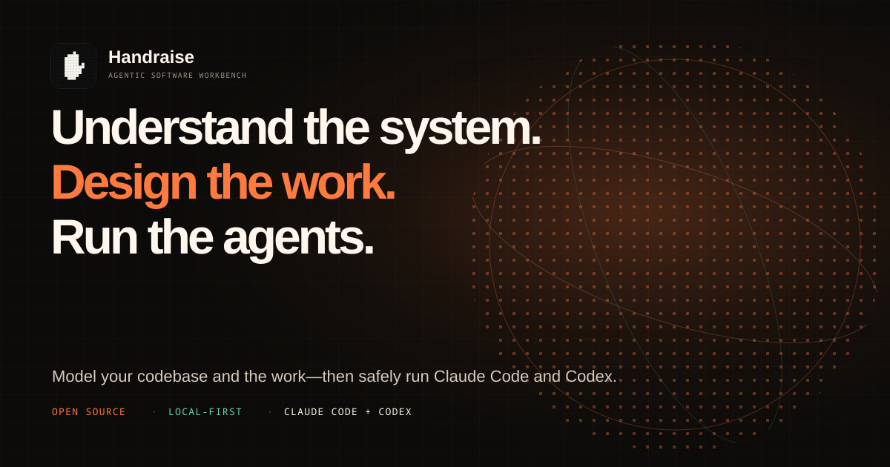

# Handraise

<p align="center">
  
</p>

<p align="center">
  <strong>A local-first agentic software workbench for understanding a codebase, designing executable work, and safely running coding agents.</strong>
</p>

<p align="center">
  <a href="https://handraise.pages.dev/">Website</a> ·
  <a href="#quickstart">Quickstart</a> ·
  <a href="#how-it-works">How it works</a> ·
  <a href="#documentation">Documentation</a>
</p>

<p align="center">
  
  
  
  <a href="LICENSE"></a>
</p>

Handraise turns repository evidence and product intent into reviewable system
maps, durable work contracts, and controlled agent runs. It keeps the entire
loop on your machine, uses the provider CLIs you already trust, and leaves every
important state transition under human control.

```text
repository + history + product intent
                  │
                  ▼
  Understand ──► Design ──► Review ──► Run ──► Reconcile
    evidence      drafts     accept     agents     learning
```

Agents run in real `tmux` sessions, so closing the browser never kills them.
When a session needs attention, Handraise surfaces the reason, the exact
permission request, and the live terminal in one place.

## Why Handraise

### Understand the system

- Create bounded, read-only snapshots of a repository.
- Explore modules, dependencies, interfaces, tests, data, deployables, and
  change coupling with evidence and uncertainty attached.
- Use the built-in analyzer everywhere, with optional richer local analysis
  through an existing compatible Graphify installation.

### Design the work

- Keep product direction separate from facts inferred from code.
- Compare responsibility-oriented component boundaries and outcome-oriented
  front plans before accepting either.
- Review exact diffs and publish accepted Markdown contracts transactionally;
  drafts never silently become repository truth.

### Run the agents

- Launch Claude Code and Codex in isolated worktrees with repository, component,
  front, dependency, and verification context.
- See working, idle, blocked, and permission states across repositories.
- Answer typed permission requests, open live terminals, and request graceful
  wrap-up without guessing from terminal output.
- Preserve run evidence and feed discoveries back into an explicit review loop.

## Quickstart

### Requirements

- [Node.js](https://nodejs.org/) 20 or newer and npm
- [tmux](https://github.com/tmux/tmux/wiki)
- Python 3 for the attention and permission hooks
- Git
- An installed and authenticated [Claude Code](https://docs.anthropic.com/en/docs/claude-code)
  or [Codex](https://developers.openai.com/codex/) CLI

### Install from source

```bash
git clone https://github.com/martin882003/handraise.git
cd handraise
npm ci
npm run build
npm link
```

Install the agent hooks, check the host, connect a repository, and start the
local server:

```bash
handraise hooks install
handraise doctor
handraise repo add ~/code/my-project
handraise serve
```

Open [http://127.0.0.1:4177](http://127.0.0.1:4177). A browser on the same host
is admitted as the implicit local client; remote clients must pair explicitly.

> The hooks are inert outside sessions started by Handraise. They preserve
> unrelated Claude Code and Codex configuration, and installation, repair, and
> removal are idempotent.

### Start an agent from the CLI

The browser provides the guided workflow. The CLI remains useful for scripting
and direct operation:

```bash
handraise start api \
  --dir ~/code/my-project \
  --component backend \
  --front authentication \
  --agent codex \
  --effort high
```

## How it works

Handraise deliberately separates five kinds of state:

| State | Meaning | Storage |
|---|---|---|
| Observed | Source, history, topology, and runtime evidence | Private local snapshots |
| Declared | Product goals, constraints, terminology, and priorities | Accepted repository contracts |
| Proposed | Generated maps, architectures, and plans | Private local drafts |
| Accepted | Human-reviewed components, fronts, and releases | Versionable Markdown in `.handraise/` |
| Execution | Sessions, worktrees, checks, permissions, and outcomes | `tmux`, Git, and local run records |

The core transition is guarded in both the server and the UI:

```text
OBSERVE ──► PROPOSE ──► REVIEW ──► ACCEPT ──► EXECUTE ──► RECONCILE
read-only     drafts      human      atomic      isolated      suggested
evidence      only        edits      publish     runtime       changes
```

- Accepted contracts are Markdown-first and reviewable in Git.
- Derived graphs, model transcripts, job logs, and drafts stay under
  `~/.handraise/` rather than becoming repository truth.
- Planning cannot allocate a worktree or start an agent as a side effect.
- A run must pass revision, dependency, ownership, capability, and Git safety
  checks before execution begins.
- Runtime observations can propose changes; they cannot silently rewrite
  accepted intent.

## Agent and repository support

| Capability | Current support |
|---|---|
| Agent execution | Claude Code and Codex |
| Attention and typed permissions | Claude Code and Codex through user-level hooks |
| Model-assisted planning | Codex CLI using its existing ChatGPT authentication |
| Repository analysis | Built-in local analyzer; compatible Graphify installations are optional |
| Native repositories | Read/write `.handraise/` contracts with reviewed publication |
| Director repositories | Existing contracts are detected; unsupported mutations remain read-only |
| Persistent service | Linux user service through systemd |
| Desktop notifications | Optional on Linux through `notify-send` |

Provider credentials are never copied into Handraise. If model-assisted
planning would send selected source outside the machine, the server-host client
must review the exact snippets, byte count, provider, model, and destination
before authorizing it.

## CLI reference

| Command | Purpose |
|---|---|
| `handraise serve` | Start the local server on `127.0.0.1:4177` |
| `handraise server status` | Check health and runtime readiness |
| `handraise repo add <path>` | Connect a Git repository |
| `handraise repo list` | List connected repositories |
| `handraise start <name> [options]` | Start or reconnect an agent session |
| `handraise list` | List live Handraise sessions |
| `handraise doctor` | Diagnose dependencies, agents, auth, hooks, and runtime state |
| `handraise hooks status` | Inspect the Claude Code and Codex integrations |
| `handraise service install` | Install and start the Linux user service |
| `handraise auth reset --yes` | Revoke every paired remote client |

## Remote access

Handraise binds to loopback by default and does not provide a hosted relay.
From **Settings → Pair another client**, the server-host client can create a
short-lived QR/code for a private-network or HTTPS origin.

For private access from another device, place an authenticated network layer in
front of the loopback server. For example, with Tailscale:

```bash
handraise serve
tailscale serve --bg http://127.0.0.1:4177
```

An optional `cloudflared` installation enables supervised temporary Quick
Tunnels from Settings. Direct `--host 0.0.0.0` binding is intended only for a
trusted private network. Never expose the raw HTTP listener to the public
Internet: Handraise can control real processes on your machine.

Remote clients receive revocable HTTP-only sessions after pairing. Unsafe
cross-origin API requests are rejected, and only the implicit server-host client
can authorize host-sensitive operations such as source transfer or managed
public exposure.

## Development

Install dependencies and build the client once:

```bash
npm ci
npm run build
```

For local development, run the API and Vite client in separate terminals:

```bash
npm start
npm run dev:ui
```

Before submitting a change, run the same core checks used by the package gate:

```bash
npm run build
npm run typecheck
npm test
npm run benchmark:gate
```

The benchmark is versioned and evidence-based. Hard safety, schema, mutation,
and provenance failures have zero tolerance; model confidence is not accepted
as release evidence.

## Documentation

| Topic | Document |
|---|---|
| Product thesis and boundaries | [Product vision](docs/PRODUCT_VISION.md) |
| Delivery order and current milestones | [Product roadmap](docs/PRODUCT_ROADMAP.md) |
| System design and state model | [Product architecture](docs/PRODUCT_ARCHITECTURE.md) |
| Functional and quality contracts | [Product requirements](docs/PRODUCT_REQUIREMENTS.md) |
| Read-only evidence and system maps | [Repository intelligence](docs/REPOSITORY_INTELLIGENCE_CONTRACT.md) and [semantic system map](docs/SEMANTIC_SYSTEM_MAP.md) |
| Component/front design and publication | [Component designer](docs/COMPONENT_ARCHITECTURE_DESIGNER.md), [front planner](docs/FRONT_PLANNING_ASSISTANT.md), and [transactional publication](docs/TRANSACTIONAL_PLAN_PUBLICATION.md) |
| Agent execution and feedback | [Plan-driven orchestration](docs/PLAN_DRIVEN_AGENT_ORCHESTRATION.md) and [outcome learning](docs/OUTCOME_LEARNING_LOOP.md) |
| Quality gate and latest evidence | [Planning quality evaluation](docs/PLANNING_QUALITY_EVALUATION.md) and [latest benchmark](benchmark/results/latest.md) |

## Project status

Handraise is an open-source public preview. The core local workflow is usable,
while release hardening, the integrated Understand → Design → Run experience,
and multi-repository product coordination continue to evolve. APIs and
repository schemas may change before the first stable release.

Issues and pull requests are welcome. Please include the relevant verification
evidence with behavior changes.

## License

[MIT](LICENSE) © Martín Herrán
